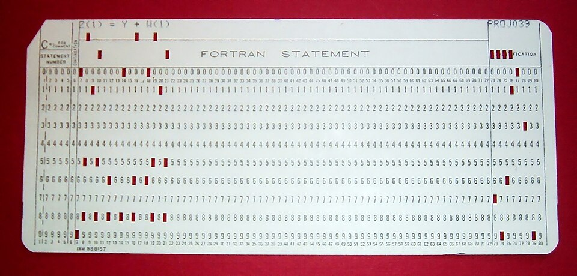
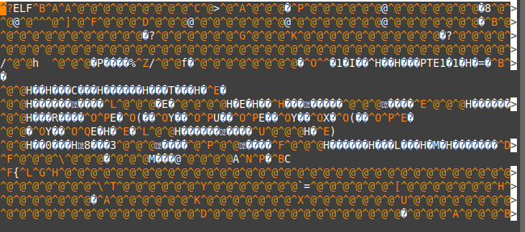
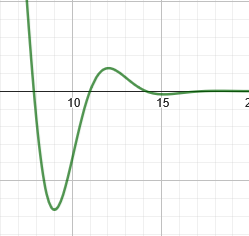

# Capítulo 1 - Introdução

Neste capítulo visamos apresentar a
linguagem Fortran (na versão Fortran 90) do zero, supondo pouca
familiaridade com programação, mas algum conhecimento de métodos
numéricos (não são obrigatórios, mas serão de grande ajuda para a
compreensão de algumas motivações e exemplos). Ao longo deste
capítulo vamos introduzir os conhecimentos necessários para
construirmos um dos métodos numéricos mais simples e clássicos: o
Método da Bisseção. E, para além de introduzirmos o ferramental,
vamos construir um código para este método ao longo das seções, de
forma que ao final do capítulo teremos uma implementação funcional
do método em Fortran.

## Características da linguagem

Do inglês, FORmula TRANslation system, a linguagem FORTRAN foi um avanço nas décadas
de 60 e 70 na programação de computadores. Antes dela, o paradigma principal
de codificação dos programas de computador era escrevê-loss diretamente em 
linguagem de montagem (Assembly), instruções que eram compreendidas de forma
praticamente direta pelos computadores. Porém para nós humanos (que não somos
computadores) é muito difícil e pouco transparente escrever fluxos e algoritmos
tão próximos do metal. Visando incorporar abstrações que facilitariam a vida dos
programadores, Foi criado o FORTRAN. 

Nessa metade final do século XX, o surgimento do computador veio como ferramenta
de cálculo para auxiliar na execução de métodos sofisticados e muito extensos que
eram utilizados nos contextos da época, principalmente de guerra, engenharia, etc.
Isso influenciou fortemente a maneira que a linguagem FORTRAN foi construída: pensada
para fazer computação científica, e acelerar o progresso nestas áreas; e tem impactos
que reverberam até as versões mais modernas da linguagem, devido a este processo
histórico.

Algumas das filosofias principais da linguagem são:

- Ser estrita e eficiente para o que ela foi pensada

O que explica a grande quantidade de bibliotecas extremamente otimizadas para álgebra
linear, implementação nativa de estruturas importantes da matemática a nível de 
engenharia como números complexos, arrays multi-dimensionais e especificação de precisão
numérica, e ausência de estruturas comuns em linguagens de propósito geral (como recursividade
e ponteiros, até a década de 90)

- Ser estável e retrocompatível

Muito tempo e esforço já foi colocado para construir programas robustos e de alta complexidade
quando FORTRAN foi amplamente adotado pela comunidade científica: simulações, implementações de 
algoritmos para resolução de inúmeros problemas não-lineares, etc. Para que nenhum destes projetos
se perdessem durante as atualizações da linguagem, FORTRAN é extremamente retrocompatível, de forma
que todos os principais compiladores desenvolvidos até hoje são capazes de compilar programas 
escritos na década de 70 sem alterá-los em 1 linha de código (o que não ocorre, por exemplo, com Python
2 vs Python 3). 

E para também certificar que os programas desenvolvidos sejam duráveis e pouco sucetíveis a erros
numéricos (já que isso pode ser fatal numa engenharia naval, aeroespacial e afins), o compilador
é muito rigoroso quanto ao uso das estruturas da linguagem, e não dá muito espaço para implementações
exóticas e imprevisíveis (diferente da linguagem C, por exemplo). O design da sintaxe da linguagem
segue esta mesma lógica.

### Comparativo: FORTRAN 77 (fixed-form) vs FORTRAN 90 (free-form)

Até sua versão 77, FORTRAN rodava principalmente nos grandes centros de computação mantidos pelas
universidades e pelo governo dos Estados Unidos. Estas máquinas comumente utilizavam cartões perfurados
como forma de lerem e carregarem os programas desenvolvidos para a memória, como este da foto abaixo



Devido a isso, a sintaxe do FORTRAN 77 é conhecida como sendo de forma fixa, pois existe uma quantidade
limite de caracteres por linha, além de um desígnio especial para cada faixa de caracteres na coluna. 
Você pode consultar mais detalhes em [nossa página de FORTRAN77](Fortran_77.md).

Como você deve imaginar, isto não é nada prático nos moldes atuais (e já na época era problemático).
Para endereçar este e alguns outros problemas, na versão FORTRAN 90 adotou-se uma sintaxe diferente,
a de forma livre. Nesta, removeu-se a limitação de colunas, aumentou-se a quantidade de caracteres
permitido nos nomes das variáveis e das funções, comentários podem ser feitos em qualquer trecho do
código utilizando `!`, dentre muitas outras convenções de programação que foram criadas com o aumento
em popularidade das linguagens C e Pascal, além da reformulação das estruturas físicas dos computadores
(telas, teclados, disquetes, sistemas operacionais, etc).

Nesta página, iremos trabalhar com o padrão FORTRAN 90. Vamos começar preparando o ambiente de 
execução dos nossos programas em Fortran.

## Tópico 1: Compilação, arquivo fonte e arquivo executável

Antes de começarmos a programar, vamos aprender a como fazer um
programa em Fortran ser executado. Vamos começar definindo alguns
termos:

- Código-fonte: O código fonte é o arquivo escrito na linguagem de
  programação (no nosso cado, em Fortran). Ele contém as instruções
  do programa, porém o computador não sabe executar estes aquivos.
  Utilizaremos a extensão ".f90" nos nossos arquivos. OBS: programas
  escritos em FORTRAN 77 normalmente utilizam a extensão ".f". Segue
  um exemplo de código-fonte:

```
program cilindro
! Calcula a área de um cilindro.
!
! Declara as variáveis e constantes.
implicit none ! Requer que todas as variáveis sejam declaradas
integer :: ierr
real :: raio,altura,area
real , parameter :: pi = 3.14159
do
   ! Pergunta ao usuário o raio e a altura e lê os valores.
   write (*,*) "Entre com o raio e a altura, 'q' para sair."
   read (*,*,iostat=ierr) raio,altura
   !
   ! Se o raio e a altura não puderam ser lidos da entrada, termina o programa.
   if (ierr /= 0) stop "finalizando o programa"
   !
   ! Calcula a área. O sinal ** significa "eleva a uma potência".
   area = 2*pi*(raio**2 + raio*altura)
   !
   ! Escreve as variáveis de entrada (raio, altura) e a saida (área) na tela.
   write (*,"(1x,'raio=',f6.2,5x,'altura=',f6.2,5x,'area=',f6.2)") raio,altura,area
end do
end program cilindro
```

- Compilador: O compilador é o programa responsável por traduzir
  as instruções do nosso código-fonte para instruções que o
  computador sabe executar. Este programa recebe como entrada o
  código-fonte, e gera um arquivo executável como saída. Utilizaremos
  o compilador "gfortran".

- Arquivo executável: O arquivo executável é o arquivo que,
  efetivamente, irá rodar no computador, executando nosso programa.
  Este arquivo não é legível para nós, humanos, e por isso usamos as
  abstrações de uma linguagem de programação. Veja o que ocorre ao
  tentarmos abrir um arquivo binário com um leitor de texto:

  

Entendidos estes conceitos básicos, vamos fazer os 3 passos principais 
para sairmos de um código fonte a um binário executável:

### Como instalar um compilador (gfortran)

### Como compilar um código-fonte utilizando o compilador

### Executando o arquivo executável gerado pela compilação

## Tópico 2: Estrutura básica de um programa, print simples, variáveis e operações básicas.

Para começarmos a escrever um programa em Fortran, basta
criarmos um arquivo novo em branco, e salvá-lo com a extensão
".f90".

Todo programa válido em Fortran precisa ter um bloco "program",
com o nome do programa. Dentro deste bloco, temos nosso código
principal a ser executado. Vamos iniciar fazendo um programa
clássico ao começarmos a aprender uma nova linguagem de
programação: Um programa que mostra "Olá mundo!" (ou "Hello
world!") na tela e termina sua execução.

```
	program exemplo
	    print *, 'Olá mundo!'
    end program exemplo
```

Compilando e executando este programa, o programa imprime na
tela "Olá mundo" e termina. O nome que segue a palavra chave
`program` é o nome do programa, e o bloco é terminado
por `end program`.

O comando `print` utiliza um primeiro argumento, que
é a formatação, e em seguidas as informações a serem mostradas.
Como não queremos nenhuma formatação específica para nossos dados,
usamos `*` como primeiro argumento, e em seguida a
string `"Olá mundo!"`.

### Tópico 2.1: Variáveis

Um dos conceitos mais básicos de programação são as variáveis.
Elas são áreas de memória que guardam algum valor. Fortran é uma
linguagem **fortemente tipada**, ou seja, para declaramos e
usarmos uma variável precisamos, primeiro, indicar qual o
**tipo** dessa variável (diferente de Python, por exemplo, que é
fracamente tipada). Nativamente, existem 5 tipos de variáveis em
Fortran:

- `integer` \- para valores inteiros, positivos ou
  negativos
- `real` \- para valores em ponto-flutuante (números
  fracionários)
- `complex` \- para valores complexos, consistindo de
  uma parte real e uma parte imaginária
- `character` \- para texto em geral
- `logical` \- para valores verdade (verdadeiro ou
  falso)

Para declaramos uma variável usamos a sintaxe `tipo ::
nome` , onde `tipo` é o tipo da variável e
`nome` é o nome da variável. Por exemplo, se quisermos
declarar 2 variáveis reais `x` e `y`,
fazemos:

```
    real :: x
    real :: y
```

Nomes de variável precisam começar por uma letra, e podem ter
letras, números e underscores " `_`". Não são aceitos
caracteres pontuados como "é", "ã", "ó", etc.

Variáveis do tipo `logical` trabalham com os valores
`.true.` e `.false.` . Alguns compiladores
podem permitir conversão implícita de valores inteiros para lógico
(i.e. assumir que 0 é falso e qualquer número inteiro diferente de
0 é verdadeiro), mas esse comportamento não é o padrão da
linguagem, não conte sempre com ele, e evite sempre que
possível.

Exemplos de declaração de variáveis para cada tipo:

```
    program variaveis
		implicit none

		integer :: i
		real :: distancia
		complex :: frequencia
		character :: inicial
		logical :: eh_primo

		i = 1
		distancia = 1.41421356
		frequencia = (1.0, -0.5)
		inicial = "f"
		eh_primo = .false.
    end program variaveis
```

Por padrão, utilizamos letras minúsculas ao programar, mas a
linguagem não é sensível a CaPiTaLiZaÇãO, então maiúsculas e
minúsculas podem ser usadas para os tipos e nomes. Porém, por
questões de organização do código, seja consistente quanto a isso
ao longo do programa.

Perceba que a primeira instrução do nosso programa é um
`implicit none`, e é por um bom motivo: Devido a
influência e herança do Fortran 77, por padrão, variáveis que
começam pelas letras I,J,K,L,M,N são do tipo `integer`,
e variáveis começando pelas outras letras restantes do alfabeto são
do tipo `real`. Hoje em dia, não se é mais recomendado
usar essa tipagem implícita, que permaneceu apenas por motivos de
retrocompatibilidade (ser possível executar códigos-fonte antigos
utilizando compiladores mais novos, sem ter que alterar o código).
Para indicarmos que não utilizaremos este padrão de tipagem
implícita, incluímos a instrução `implicit none` no
começo do programa.

#### Precisão de Variáveis

A representação de valores reais, em Fortran, é feita utilizando
**ponto flutuante**. Nesta forma de representação, os números
possuem sua parte fracionária armazenada em um tamanho finito de
memória. Porém, existem diferentes padrões de armazenamento destes
números, mas não iremos nos aprofundar neste assunto e abordaremos
apenas 2 casos de nosso interesse: Float32 e Float64 - definidos no
padrão IEE 754. Float32 é o padrão que reserva 32 bits para
armazenamento de um número, e possui uma precisão de 6 a 9 dígitos
decimais. Já o padrão Float64 é o padrão que reserva 64 bits para
armazenamento do número, possuindo uma precisão maior: de 15 a 17
dígitos decimais.

**Por padrão, Fortran utiliza Float32** para armazenar os
números reais no tipo de variável `real`. Caso queiramos
armazenar valores com maior precisão, usando o padrão Float64,
podemos utilizar um módulo disponibilizado pelos compiladores mais
recentes de Fortran (2003/2008 em diante): o
`iso_fortran_env`. Neste módulo, temos a definição de
várias constantes, sendo algumas delas as de definição de precisão
\- conhecidas como "`kind` parameters".

Para declararmos uma variável real com 64 bits de precisão,
importamos o módulo e declaramos a variável como
`real(real64)` :

```
    use, intrinsic :: iso_fortran_env
    implicit none

    real(real64) :: valor
```

Essa informação é expressamente relevante para computações de
alta precisão. Se quisermos representar valores literais em
Float64, colocamos "\_real64" no final do valor. Veja a diferença na
precisão de representação do número de Euler:

```
    program euler
            use, intrinsic :: iso_fortran_env
            implicit none

            real :: v1
            real(real64) :: v2

            v1 = exp(1.0)
            v2 = exp(1.0_real64)

            print *, v1
            print *, v2

    end program euler
```

E temos `v1 = 2.71828175` e `v2 =
2.7182818284590451`. No primeiro caso, temos erro no 7º
dígito, e no segundo apenas no 16º dígito. Note que foi preciso
chamar a função `exp(x)` (que retorna \(e^x\)) passando como
argumento um valor de 64 bits, para que ele calculasse uma resposta
com 64 bits de precisão. Lembre-se disso e tome cuidado para não
acabar armazenando, por engano, um resultado gerado por precisão
simples em uma variável de precisão dupla. No mesmo exemplo:

```
    program euler
            use, intrinsic :: iso_fortran_env
            implicit none

            real(real64) :: v3
            v3 = exp(1.0)

            print *, v3

    end program euler
```

Onde `v3 = 2.7182817459106445` parece ser um valor
com precisão maior, por estar em uma variável que é capaz de
representar números com mais precisão, mas cujo o conteúdo é
resultado de uma operação em precisão simples (ainda há erro no 7º
dígito da constante).

### Tópico 2.2: Operações Básicas

Assim como muitas outras linguagens, Fortran vem com alguns
operadores aritméticos básicos, tabelados abaixo em ordem de
precedência:

| Operador | Operação      |     |
| -------- | ------------- | --- |
| **       | Exponenciação |     |
| *        | Multiplicação |     |
| /        | Divisão       |     |
| +        | Adição        |     |
| -        | Subtração     |     |

**Muito cuidado** com a precedência dos operadores ao colocar
expressões matemáticas grandes no seu código! Principalmente se
elas envolvem frações: a expressão pode acabar calculando uma
expressão diferente da pretendida. Por exemplo, se quisermos
calcular uma média simples entre 3 números, ao escrever:

```
    program media
		print *, 3 + 4 + 5 / 2
    end program media
```

Temos como resultado `9`, e não `6`, pois
quem tem a precedência maior é a divisão, então primeiro é avaliado
`5 / 2` e depois são feitas as somas. Para alterar
precedência de operações, envolvemos a expressão com parênteses -
que possuem a maior precedência entre os operadores:

```
    program media
		print *, (3 + 4 + 5) / 2
    end program media
```

E agora temos o comportamento esperado. Outro detalhe curioso no
trecho de código anterior é que a expressão foi avaliada como igual
a `9`, e não `9.5` como esperaríamos da
aritmética usual. Isto ocorre por outra característica importante
da linguagem: operações entre **inteiros geram inteiros**,
operações com **reais geram reais**. Números **reais** são
representados **com ponto decimal**, ainda que sua parte decimal
seja toda zero. Essa regra explica o porquê de

```
    program divisao
		print *, 5 / 2
    end program divisao
```

ser avaliado como `2` , e

```
    program divisao
	    print *, 5.0 / 2
    end program divisao
```

ser avaliado como `2.50000000` . Portanto, **cuidado**
**também** com os **tipos das variáveis** que você estiver
operando e com a formatação dos números.

#### Comentários

Apesar de não ser um operador, vamos aproveitar o final desta
seção para falar de comentários. Linhas de comentários são
iniciadas por `!`, e servem para escrever texto que não
será interpretado pelo programa. Comentários são úteis para
documentar o que está sendo feito no programa e para guiar as
pessoas que forem ler o código-fonte.

```
    program comentarios
		implicit none
		! Esta linha será ignorada pelo compilador, escreva o que quiser

		real :: alpha  ! Coeficiente do termo linear
		real :: beta   ! Coeficiente do termo não-linear
		real :: x      ! Variável de entrada
		real :: y

		alpha = 3.0
		beta = 1.0
		x = 1

		! Calculando a relação y(x)
		y = (alpha * x) + (beta * x * x)

		print *, y

    end program comentarios
```

Não faça comentários em excesso, pois comentários demais podem
prejudicar a legibilidade do código, mas também evite deixar
códigos totalmente não comentados, já que você pode não se lembrar
o que cada linha faz ao revisitar o código no futuro. Uma dica para
achar esse equilíbrio é escrever bons nomes de variáveis e funções,
que sejam autodescritivos e dispensem comentários, quando possível.
Caso você queira adaptar uma fórmula diretamente, querendo manter a
notação original, você pode comentar as variáveis ou a fórmula
referenciada por exemplo.

## Tópico 3: Funções e Módulos

Este é um dos tópicos mais complexos, mas também um dos mais
relevantes. Leia com calma e, se preciso, pare, rode e mude o
código. Leia mais de uma vez. <!-- Fazer a introdução do Tópico 3 -->

### Tópico 3.1: Funções

Funções são um dos objetos mais explorados e utilizados na
matemática, e não será diferente para nós. No contexto de
programação, funções trazem modularidade e organização ao código,
permitindo que um trecho de código possa ser reutilizado em
diferentes locais do programa, ou até exportado para outros
programas que venhamos futuramente desenvolver.

A sintaxe para declaração de uma função em Fortran segue um
padrão como o seguinte:

```
    function nome_funcao(arg1, arg2) result(var_result)
		implicit none

		tipo1, intent(in) :: arg1
		tipo2, intent(in) :: arg2
		tipo3 :: var_result

		! Corpo da função

		return

    end funtion nome_funcao
```

Vamos destrinchar cada parte. A declaração é feita em bloco,
assim como vimos anteriormente ao criarmos o programa principal com
`program`. Ou seja, começamos a declaração com
`function nome_funcao` e terminamos com `end
function nome_funcao`. Na frente do nome da função, entre
parênteses, listamos os argumentos (ou variáveis, no jargão
matemático) da função. Podemos colocar quantos argumentos quisermos
(até mesmo nenhum). Nesse nosso exemplo, temos 2 argumentos:
`arg1` e `arg2`. Imediatamente após,
colocamos a palavra reservada `result` e, em seguida e
entre parênteses, o nome da variável que terá o valor a ser
retornado no final da função, no caso do exemplo,
`var_result`. Um ponto a ser ressaltado: funções
retornam um, e apenas um, resultado. Mas não se desespere. É
possível organizar as informações de formar a fazer uma função
retornar mais de 1 valor, porém abordaremos este tópico em outro
momento. Por enquanto, trabalharemos com estruturas mais
simples.

Ao analisarmos o corpo da função notamos, inicialmente, temos
uma linha `implicit none`, que tem o comportamento
descrito ao final do tópico 2.1, e em seguida duas linhas de
declaração de variáveis. Estas variáveis são os argumentos da
função. Porém, diferente da declaração usual vista no tópico 2.1,
temos um trecho `intent(in)` no meio da declaração. A
instrução `intent` declara quais operações (escrita e
leitura) serão feitas em uma variável. Quando colocamos
`intent(in)` na declaração da variável, estamos dizendo
que esta variável será apenas lida, mas não poderá ter seu valor
sobrescrito pela função. Essa instrução está certificando mais um
padrão de funções em Fortran: funções não devem alterar os
argumentos de entrada. Esse padrão previne comportamentos
inesperados (_side effects_) e facilita interpretação de
resultados.

Para vermos um exemplo que ilustra a importância da declaração
de intenção das variáveis, vamos abordar apenas mais um conceito e
estudar um caso. Para conseguirmos incorporar uma função em um
programa, podemos utilizar, ao final do programa, uma instrução
`contains` seguida da declaração da função. Sabendo
disso, vejamos um exemplo: Suponha que temos um vetor \(v = (v_1, v_2)
\in \mathbb{R}^2\), e queremos calcular a norma do dobro desse vetor. Ou seja,
se temos o vetor \((1, 1)\), queremos a norma de \((2, 2)\). Vamos
construir uma primeira função para isso, não seguindo o padrão com
`intent`:

```
    function norma_dobro(v1, v2) result(norma)
		real :: v1
		real :: v2
		real :: norma

		v1 = 2*v1
		v2 = 2*v2

		norma = ((v1**2) + (v2**2))**(1.0/2.0)

		return

    end function norma_dobro
```

Agora, vamos criar um programa e testar nossa função:

```
    program calcula_norma
		implicit none
		real :: norma_calculada
		real :: vec1 !1ª coordenada do vetor
		real :: vec2 !2ª coordenada do vetor

		vec1 = 1
		vec2 = 1

		norma_calculada = norma_dobro(vec1, vec2)
		print *, norma_calculada

		contains
			function norma_dobro(v1, v2) result(norma)
				real :: v1
				real :: v2
				real :: norma

				v1 = 2*v1
				v2 = 2*v2

				norma = ((v1**2) + (v2**2))**(1.0/2.0)

				return

			end function norma_dobro

    end program calcula_norma
```

Ao executarmos o nosso programa, temos como saída:

```
    2.82842708
```

Que é a norma do vetor \((2, 2)\). A princípio, parece que está tudo
bem, mas nossa função gerou um efeito colateral e não percebemos
isso. Podemos verificar o que aconteceu printando as coordenadas
\(v_1 \text{e}\ v_2\) antes e depois da chamada da função:

```

    program calcula_norma
		implicit none
		real :: norma_calculada
		real :: vec1 !1ª coordenada do vetor
		real :: vec2 !2ª coordenada do vetor

		vec1 = 1
		vec2 = 1

		print *, vec1
		print *, vec2

		norma_calculada = norma_dobro(vec1, vec2)
		print *, norma_calculada

		print *, vec1
		print *, vec2

		contains
			function norma_dobro(v1, v2) result(norma)
				real :: v1
				real :: v2
				real :: norma

				v1 = 2*v1
				v2 = 2*v2

				norma = ((v1**2) + (v2**2))**(1.0/2.0)

				return

			end function norma_dobro

    end program calcula_norma


```

E no resultado desse programa:

```
    1.00000000
    1.00000000
    2.82842708
    2.00000000
    2.00000000
```

Podemos perceber que nossa função de cálculo de norma mudou os
valores do nosso vetor original, que não era nossa intenção
inicial. Isso ocorre pois alterações em variáveis passadas como
argumentos em funções refletem as alterações externamente. Vejamos
agora o que acontece quando declaramos a função usando
`intent`:

```
    program calcula_norma
		implicit none
		real :: norma_calculada
		real :: vec1 !1ª coordenada do vetor
		real :: vec2 !2ª coordenada do vetor

		vec1 = 1
		vec2 = 1

		print *, vec1
		print *, vec2

		norma_calculada = norma_dobro(vec1, vec2)
		print *, norma_calculada

		print *, vec1
		print *, vec2

		contains
			function norma_dobro(v1, v2) result(norma)
				real, intent(in) :: v1
				real, intent(in) :: v2
				real :: norma

				v1 = 2*v1
				v2 = 2*v2

				norma = ((v1**2) + (v2**2))**(1.0/2.0)

				return

			end function norma_dobro

    end program calcula_norma
```

E ao tentarmos compilar e executar este programa:

```
    ./main.f95:27:3:

             27 |    v1 = 2*v1
    Error: Dummy argument ‘v1’ with INTENT(IN) in variable definition
    context (assignment) at (1)
    ./main.f95:28:3:

             28 |    v2 = 2*v2
    Error: Dummy argument ‘v2’ with INTENT(IN) in variable definition
    context (assignment) at (1)
```

Nosso compilador não finalizou a compilação pois detectou uma
inconsistência: Declaramos que \(v_1 \text{e}\ v_2\) são apenas argumentos de
entrada, mas em seguida tentamos modificar o valor dessas
variáveis. Aí está a importância do uso do `intent`:
caso nós, programadores, acidentalmente façamos uma atribuição
indevida, seremos alertados pelo compilador de que estamos fazendo
algo que provavelmente não deveríamos estar fazendo.

Para contornar nosso problema da função
`calcula_norma`, podemos:

1. Criar novas variáveis internas da função, que essas sim poderão
   ser modificadas, copiar o valor dos argumentos originais nestas
   variáveis e operar com ela; ou
2. Usar os valores originais diretamente no cálculo da norma

Na primeira proposta, nossa função ficaria com a seguinte
cara:

```
    function norma_dobro(v1, v2) result(norma)
		real, intent(in) :: v1
		real, intent(in) :: v2

		real :: coord1
		real :: coord2
		real :: norma

		coord1 = v1
		coord2 = v2

		coord1 = 2*coord1
		coord2 = 2*coord2

		norma = ((coord1**2) + (coord2**2))**(1.0/2.0)

		return

    end function norma_dobro
```

Com a segunda proposta:

```
    function norma_dobro(v1, v2) result(norma)
		real, intent(in) :: v1
		real, intent(in) :: v2
		real :: norma

		norma = (((2*v1)**2) + ((2*v2)**2))**(1.0/2.0)

		return

    end function norma_dobro
```

E, com qualquer uma dessas versões, nosso resultado final ao
executar o programa será:

```

    1.00000000
    1.00000000
    2.82842708
    1.00000000
    1.00000000


```

Evitamos, assim, alterações nos dados originais. Dois
comentários valem ser feitos: Apesar de ter menos código, a segunda
implementação da função é bem mais difícil de ser entendida do que
a primeira implementação. Em programas mais complexos, isso pode
vir a ser um problema para outros programadores que tentem entender
o comportamento da função, e até mesmo para quem escreveu a função
ao ler o próprio código futuramente. Procure fazer códigos
compreensíveis e, quando preciso, comente linhas mais difíceis ou
relevantes. Segundo ponto: colocar o bloco de funções abaixo do
programa principal não é melhor maneira de organizar o seu código.
A maneira ideal de se fazer esta organização é utilizando Módulos,
que será nosso próximo assunto, no tópico 3.3.

### Tópico 3.2: Funções Intrínsecas

Fortran já existe a muito tempo, e é utilizado para diversos
fins. Porém, como várias delas acabaram por precisar de funções
comuns entre elas, a linguagem já implementa algumas destas funções
para nos poupar de ter que defini-las nós mesmos. Buscando por
"Intrinsic functions in Fortran 90" na internet, você vai encontrar
algumas relações/listas destas funções. Alguns dos exemplos de
funções ofertadas são:

- Valor Absoluto - `ABS`
- Máximo - `MAX`
- Logaritmo Natural - `LOG`
- Exponencial - `EXP`
- Raiz Quadrada - `SQRT`
- Cosseno - `COS`
- Arco tangente - `ATAN`
- Conjugado Complexo - `CONJG`, etc

Normalmente, as implementações destas funções são uma das
melhores possíveis (geralmente são rápidas!). Então, quando for
criar uma função simples pro seu código, veja se ela já é oferecida
nativamente pela linguagem. Se sim, dê prioridade a implementação
nativa.

### Tópico 3.3: Módulos

Módulos, como o próprio nome sugere, trazem modularidade ao
programa. Ao subdividirmos um grande programa em componentes
menores, facilitamos a manutenção e a eventual reutilização desses
componentes em outros programas. Dessa forma, funções que são
utilizadas em vários programas diferentes só precisarão ser
escritas uma vez e reutilizadas sempre que possível. Além disso,
você só precisará alterar 1 trecho que código para aplicar a
mudança em vários programas de uma só vez (em vez de fazer a
alteração programa a programa).

A sintaxe da declaração de um módulo segue um padrão como o
seguinte:

```
    module nome_do_modulo
		implicit none

    contains
		! Aqui começa o bloco de declaração de
		! funções, variáveis, e o que mais quisermos

    end module nome_do_modulo
```

E, para usarmos um módulo em um programa, incluímos uma linha
`use nome_do_modulo` logo abaixo da primeira linha do
programa. Para o nosso exemplo do tópico anterior, podemos criar um
módulo de normas, e teremos um programa reestruturado da seguinte
forma:

```
    module normas
		implicit none

    contains
		function norma_do_dobro(v1, v2) result(norma)
				real, intent(in) :: v1
				real, intent(in) :: v2

				real :: coord1
				real :: coord2
				real :: norma

				coord1 = v1
				coord2 = v2

				coord1 = 2*coord1
				coord2 = 2*coord2

				norma = sqrt((coord1**2) + (coord2**2))

				return

		end function norma_do_dobro
    end module funcs

    program calcula_norma
		use normas
		implicit none
		real :: norma_calculada
		real :: vec1 !1ª coordenada do vetor
		real :: vec2 !2ª coordenada do vetor

		vec1 = 1
		vec2 = 1

		print *, vec1
		print *, vec2

		norma_calculada = norma_do_dobro(vec1, vec2)
		print *, norma_calculada

		print *, vec1
		print *, vec2

    end program calcula_norma
```

Desta forma, agrupamos funções parecidas, ou de mesmo contexto,
sem misturá-las com todas as outras funções do código. Além disso,
veremos posteriormente como módulos podem ser importados e
exportados entre diferentes programas, ao declará-los em arquivos
separados e usá-los em nossos programas.

## Tópico 4: Estruturas Condicionais: IF - THEN - ELSE

Já sabemos como montar um programa que executa do começo ao fim
de acordo com um procedimento inicialmente bem determinado. Mas e
se o comportamento do programa puder variar no meio da execução,
dependendo da entrada fornecida? Não saberemos de antemão como o
programa irá executar, mas podemos preparar o código para fazer as
decisões em tempo de execução. Para fazermos isso, vamos ver como
funcionam os desvios condicionais.

### Tópico 4.1: Operadores Lógicos

Vimos anteriormente operadores aritméticos (+, -, \*, etc) e como
operam valores numéricos. Mas, quando a álgebra em questão é a
álgebra de Boole, precisamos de novos operadores que lidam com os
valores verdade `.true.` e `.false.`.

Para formarmos expressões lógicas, podemos utilizar os
operadores:

| Operador | Operação                                                            |
| -------- | ------------------------------------------------------------------- |
| ==       | Verifica se os 2 operandos são iguais                               |
| /=       | Verifica se os 2 operandos são diferentes                           |
| >        | Verifica se o operando à esquerda é maior que o da direita          |
| <        | Verifica se o operando à esquerda é menor que o da direita          |
| >=       | Verifica se o operando à esquerda é maior ou igual ao da            |
| <=       | Verifica se o operando à esquerda é menor ou igual ao da<br>direita |

Estes operadores irão retornar valores `.true.` ou
`.false.`, e podemos operar estes valores com os
operadores booleanos:

| Operador | Operação                |
| -------- | ----------------------- |
| .and.    | Realiza um "E" lógico   |
| .or.     | Realiza um "OU" lógico  |
| .not.    | Realiza um "NÃO" lógico |

Com isso, podemos fazer alguns testes como: Se um certo valor é
maior que 0, se 2 valores são iguais, etc.

### Tópico 4.2: Comando IF-THEN-ELSE

Agora que sabemos como montar e comparar expressões lógicas,
vamos usá-las com o comando IF-THEN-ELSE. A sintaxe do comando
é:

```
    if (expressao_logica) then
		! Código a ser executado se a expressão for verdadeira
    else
		! Código a ser executado se a expressão for falsa
    end if
```

O trecho `else` pode ser omitido, caso não haja
nenhum caso explícito para a condição falsa. E com isso,
conseguimos implementar várias funções que são definidas por parte,
como:

**Função Valor Absoluto**

```
    function absoluto(x) result(y)
		real, intent(in) :: x
		real :: y

		y = x

		if (x < 0) then
				y = -y
		end if

		return

    end function absoluto
```

**Função de Heaviside**

```
    function heaviside(x) result(y)
		real, intent(in) :: x
		real :: y

		if (x >= 0) then
				y = 1
		else
				y = 0
		end if

		return

    end function heaviside
```

E assim por diante. Dica de programação: evite colocar muitos
IF's aninhados uns dentro dos outros, pois isso costuma dificultar
a leitura do código. Evite também colocar expressões muito longas
no teste do IF, e tome cuidado com a precedência das operações (use
parênteses, na dúvida). Aqui um exemplo de um bloco difícil de
entender devido a IF's aninhados:

```
    real, intent(in):: a
    real, intent(in):: b
    real, intent(in):: p

    if (p >= a) then
		if (p <= b) then
			if (p == (a+b)/2 ) then
				print *, "p está no intervalo e é ponto medio"
			else
				if (p > (a+b)/2) then
					print *, "p está no intervalo, e está mais próximo de", b
				else
					print *, "p está no intervalo, e está mais próximo de", a
				end if
			end if
		else
			print *, "p está fora do intervalo, e depois de", b
		end if
	else
		print *, "p está fora do intervalo, e antes de", a
    end if
```

Perceba que você precisa manter os estados lógicos na sua cabeça
para acompanhar a execução. Para resolver estes problemas,
geralmente aplicamos uma de duas técnicas: Inversão Lógica ou
Extração em Função. Na primeira, usamos o teste lógico inverso
combinados com `return`, de forma que daquele trecho em
diante, sabemos que não estamos mais naquele caso. O segundo método
consiste em extrair subtestes em funções separadas, que realizam a
lógica internamente, e apenas chamar estas funções no nosso bloco
de IF. Veja como fica o código acima utilizando a primeira
técnica:

```
    real, intent(in):: a
    real, intent(in):: b
    real, intent(in):: p

    if (p < a) then
		print *, "p está fora do intervalo, e antes de", a
		return
    end if

    if (p > b) then
		print *, "p está fora do intervalo, e depois de", b
		return
    end if

    if (p == (a+b)/2 ) then
		print *, "p está no intervalo e é ponto medio"
		return
    end if

    ! Neste ponto, sabemos que p está no intervalo e não é ponto médio
    if (p > (a+b)/2) then
		print *, "p está no intervalo, e está mais próximo de", b
    else
		print *, "p está no intervalo, e está mais próximo de", a
    end if

    return
```

Bem melhor de acompanhar, não é? Usando a segunda técnica
poderíamos, por exemplo, extrair o bloco que testa se
`p` está dentro do intervalo \((a, b)\) em uma função, e
verificar as outras propriedades no nosso IF após chamar esta
função. Caso queira, faça este segundo caso como exercício. Em
alguns outros cenários, esta segunda técnica pode fazer mais
sentido que a primeira, e vice versa.

## Tópico 5: Repetição - Comando DO

Uma das maiores vantagens de se utilizar um computador para
fazer contas, além da velocidade, é que, diferente de nós seres
humanos, máquinas podem fazer tarefas repetitivas por longas horas
sem enjoarem. Portanto, deixemos essas tarefas para o computador
sempre que possível, poupando a nós, programadores humanos, dessa
tarefa. E, para isso, podemos utilizar o comando DO.

A sintaxe do comando é:

```
    do iterador = valor_inicial, valor_final, passo
		! Código a ser repetido
    end do
```

Onde: `iterador` é a variável de iteração da
repetição, `valor_inicial` é o primeiro valor que o
iterador assumirá, `valor_final` é o último valor que a
variável pode assumir e `passo` é o incremento que será
feito a cada rodada de repetição. O exemplo mais comum na
matemática? Somatórios. Digamos que queremos fazer um somatório de
1 até n da expressão \(1/k^2\), como faríamos? Desta forma:

```
    implicit none

    real :: valor
    integer :: k
    integer :: n

    valor = 0.0
    n = 100
    do k = 1, n, 1
		valor = valor + 1.0/(k*k)
    end do

    print *, valor
```

E com 3 linhas fizemos 100 operações (o valor de `n`
neste exemplo), tal qual uma notação de somatório dispensa
escrevermos 100 somas por extenso. Algumas observações sobre este
trecho de código:

- Começamos iniciando a variável `valor` com 0.0, para
  garantir que não havia nenhum lixo de memória da variável
  recém-criada. Crie o hábito de inicializar variáveis antes de
  usá-las, especialmente em situações onde serão utilizadas para
  acúmulos.
- O passo de iteração padrão do comando `do` é 1.
  Logo, é equivalente escrever `do k = 1, n, 1` ou
  `do k = 1, n`
- Por fim, cuidado com a precisão das variáveis e seus tamanhos
  máximos e mínimos ao fazer muitas operações com elas, ou que
  envolvam números muito grandes, ou muito pequenos. Pode ser que
  você se depare com um resultado estranho mesmo com um código que
  deveria funcionar, devido ao fato dos números terem ficado grandes
  demais ou pequenos demais para o tamanho de representação suportado
  pelas variáveis

Para este último ponto, podemos utilizar o próprio trecho de
código acima para nos deparamos com problemas do tipo. O somatório
expresso neste trecho converge para \(\pi^2/6\), que é aproximadamente
igual a 1,6449340668482264. Vamos testar diferentes valores de
`n` no código, para ver a convergência:

- Para n = \(10^2\) temos valor = 1.63498402
- Para n = \(10^3\) temos valor = 1.64393485
- Para n = \(10^4\) temos valor = 1.64472532
- Para n = \(10^5\) temos valor = Infinity

A soma divergiu! Ora, mas nosso código estava coerente até \(10^4\) e
a teoria diz que a soma converge. Qual foi o problema? as variáveis
`k` e `valor` são dos tipos
`integer` e `real` que, por padrão (em
FORTRAN 90), são de 32 bits! Quando `k` assume valores
próximos de \(10^5\), temos do denominador \(10^5 \times 10^5 = 10^{10} \approx 2^{33}\), que é
um número maior do que os \(2^{32}\) representáveis em uma variável do
tipo Float32 (vide Tópico 2.1). Se representarmos nossas variáveis
com mais precisão (64 bits):

```

    use, intrinsic :: iso_fortran_env
    implicit none

    real(real64) :: valor
    integer(int64) :: k
    integer(int64) :: n

    valor = 0.0
    n = 10**5_int64
    do k = 1, n
            valor = valor + 1.0_real64/(k*k)
    end do

    print *, valor


```

E agora sim temos saídas que continuam convergindo:

- Para n = \(10^5\) temos valor = 1.6449240668982423
- Para n = \(10^6\) temos valor = 1.6449330668487701
- Para n = \(10^7\) temos valor = 1.6449339668472596
- Para n = \(10^8\) temos valor = 1.6449340578345750

Detalhe: não é permitido andar com passos fracionários, como
0.5, apenas passos inteiros. Caso deseja iterar desta forma, é
preciso construir uma iteração inteira que nos permita,
internamente, representar a iteração fracionária. Por exemplo, se
queremos avaliar uma expressão de 0 até 1 com passo 0.1, não é
possível fazer

```

    do k = 0, 1, 0.1
            print *, k
    end do


```

Mas podemos fazer:

```

    do k = 0, 10, 1
            print *, k/10.0
    end do


```

Uma outra dica útil e que reflete nas possibilidades de uso do
comando `do` é que você pode andar com passos negativos,
como -1, desde que também sejam inteiros. No caso da nossa soma que
\(1/k^2\), pode ser útil que somemos dos menores números para os
maiores, com o objetivo de somar as contribuições das menores
parcelas da soma primeiro, e as maiores depois. Esta técnica pode
aumentar a precisão dos cálculos devido o não-desperdício de
precisão.

Desta forma, o mais adequado, para o nosso exemplo seria
somarmos começando de `n` e terminando em 1, já que \(1/n^2\)
é o menor número da soma, e cada um anterior é ligeiramente maior.
Sendo assim, nosso somatório ficaria de trás pra frente:

```

    use, intrinsic :: iso_fortran_env
    implicit none

    real(real64) :: valor
    integer(int64) :: k
    integer(int64) :: n

    valor = 0.0
    n = 10**5_int64
    do k = n, 1, -1
            valor = valor + 1.0_real64/(k*k)
    end do

    print *, valor


```

E conseguimos ver o impacto na precisão ao comparamos os casos
de \(10^8\) e \(10^9\) em ambas as abordagens:

Primeira abordagem:

- Para n = \(10^8\) temos valor = 1.6449340578345750, erro absoluto
  da aproximação = 9.0136513808403151E-009
- Para n = \(10^9\) temos valor = 1.6449340578345750, erro absoluto
  da aproximação = 9.0136513808403151E-009

Segunda abordagem:

- Para n = \(10^8\) temos valor = 1.6449340568482265, erro absoluto
  da aproximação = 9.9999999392252903E-009
- Para n = \(10^9\) temos valor = 1.6449340658482263, erro absoluta
  do aproximação = 1.0000000827403710E-009

E observamos que não continuamos convergindo utilizando a
primeira abordagem, enquanto na segunda sim.

**OBS:** Existem formas muito mais eficientes de se aproximar
\(\pi^2/6\), o exemplo acima é meramente didático.

## Tópico 6: Subrotinas

Neste tópico abordaremos o último assunto antes de partirmos
para nossa construção e implementação do Método da Bisseção. No
tópico 3 abordamos funções e módulos, e vimos que uma das
características padronizadas das funções é que elas não alteram os
argumentos de entrada. E para usar livremente os valores dos
argumentos de entrada, criamos variáveis auxiliares dentro do corpo
da função para armazenarem cálculos intermediários. Porém nem
sempre isso é viável ou desejado, e gostaríamos de alterar os
valores passados como argumento. Vale lembrar também que funções
retornam apenas 1 único valor. Para contornar estas limitações de
uso, temos as Subrotinas.

Subrotinas possuem comportamento e estrutura muito parecidos com
funções. A sintaxe para declaração de uma subrotina é:

```
    subroutine nome_subrotina(arg1, arg2, arg3)
		implicit none

		tipo1, intent(in) :: arg1
		tipo2, intent(inout) :: arg2
		tipo3, intent(out) :: arg3

		! Corpo da subrotina

		return
    end subroutine
```

Que é muito semelhante a declaração de uma função, mas com
algumas diferenças:

1. Não há `result` no cabeçalho, pois subrotinas não
   retornam valores. Neste caso, é preciso passar como argumento a(s)
   variável(eis) onde serão escritos os valores de retorno
2. Os argumentos não necessariamente são apenas para leitura
   ( `intent(in)`), mas podem ser pra leitura e escrita (
   `intent(inout)`) ou apenas escrita
   ( `intent(out)`)
3. Subrotinas são chamadas por `call nome_subrotina`, e
   não apenas o nome do procedimento, como é o caso das funções

Tal qual nas funções, podemos ter quantos argumentos quisermos.
No exemplo, temos 3 argumentos na rotina. Para exemplificar os
conceitos acima, vamos estruturar uma subrotina que resolva o
seguinte problema: dado dois números consecutivos da sequência de
fibonacci  \(F(n)\) e \(F(n+1)\), retornamos \(F(n+1)\) e \(F(n+2)\).

```
    subroutine fib(f1, f2)
		integer, intent(inout):: f1
		integer, intent(inout):: f2
		integer :: prox
	
		prox = f1 + f2
	
		f1 = f2
		f2 = prox

    end subroutine fib
```

Destrinchando o código:

1. Começamos definindo que nossos parâmetros da subrotina serão
   utilizados tanto para leitura quanto para escrita, além de
   definirmos todas as outras variáveis intermediárias que
   utilizaremos na subrotina.
2. Calculamos \(F(n+2)\) utilizando \(F(n+1)\) e \(F(n)\), e guardamos o
   resultado numa variável intermediária
3. Atualizamos os valores de `f1` e `f2`, e terminamos a
   subrotina

Perceba que, diferente das funções, não há `return` e
os parâmetros passados sofrem alteração. Podemos testar o código
chamando a subrotina múltiplas vezes e exibindo a sequência
gerada:

```
    module funcs
		implicit none

    contains
		subroutine fib(f1, f2)
			integer, intent(inout):: f1
			integer, intent(inout):: f2
			integer ::      prox

			prox = f1 + f2

			f1 = f2
			f2 = prox

		end subroutine fib
    end module funcs

    program test
		use funcs
		implicit none

		integer :: f1
		integer :: f2
		integer :: i

		f1 = 1
		f2 = 1

		do i = 1, 10
			print *, f1, f2

			call fib(f1, f2)
		end do
    end program test
```

E temos como saída:

```
     1           1
     1           2
     2           3
     3           5
     5           8
     8          13
    13          21
    21          34
    34          55
    55          89
```

E notamos que a cada chamada da subrotina as variáveis
`f1` e `f2` vão tendo seus valores alterados
e utilizados nas chamadas seguintes.

## Tópico 7: Construindo o Método da Bisseção

Com as técnincas e estruturas apresentadas nos tópicos
anteriores, agora temos o que precisamos para construírmos nossa
primeira versão do Método da Bisseção. Esta primeira versão será
melhorada/modificada nos tópicos seguintes, por motivos que
abordaremos ao final desta sessão. Vamos começar
relembrando/definindo a ideia algorítmica do método em alto nível
de abstração. Em suma, o método da bisseção segue os seguintes passos:

1. Começamos informando a função que queremos encontrar o 0, e o
   intervalo onde iremos começar a busca
2. Calculamos o ponto médio do intervalo
3. Verificamos se a função neste ponto é 0
4. Se sim, retornamos este ponto e terminamos
5. Se não, analisamos o sinal da função neste ponto e determinamos
   um novo intervalo
6. Repetimos, a partir do passo 2, até um critério de parada (como
   um número máximo de passos), para evitarmos um loop infinito.

Vamos contruir este programa utilizando a seguinte abordagem:
começamos escrevendo as partes centrais do código primeiro, supondo
que dispomos de todas as estruturas intermediárias e funções necessárias.
Ou seja, vamos escrever o código usando, por exemplo, uma função "`abc(x)`" 
sem termos definido "`abc`" ainda, e tendo concluído o código principal 
definimos "`abc`" (pois se não o código não funcionará).

### Tópico 7.1: Arquitetando o código

Vamos pensar nas estruturas a serem utilizadas em cada
passo.

#### 1\. Começamos informando a função que queremos encontrar o 0, e o intervalo onde iremos começar a busca

- Neste primeiro passo, precisamos pensar em como forneceremos os
  dados de entrada. Não queremos que nosso programa seja específico
  para uma função, mas sim para um grande conjunto de funções. Vamos,
  portanto, fazer um módulo a parte do programa principal, que seja
  importado pelo programa e disponibilize essas funções quando
  necessárias. Para fins de teste, vamos declarar um polinômio  \(f(x) =  x^3 - x - 2\) como função neste módulo.

```
	module funcoes
		implicit none

	contains
		! Polinômio: x^3 - x - 2
		function f(x) result(y)
			real, intent(in) :: x
			real :: y
			
			y = x**3 - x - 2
		end function f
    end module funcoes
```

- Já o intervalo gostaríamos de ter maior liberdade de escolha,
  pois podemos fazer várias escolhas de onde começar a busca. Vamos,
  então, definir no programa as variáveis a serem utilizadas,
  que nomearemos `a` e `b`.


```
    program main
		use funcoes
		
		use, intrinsic :: iso_fortran_env
		implicit none
		
		real(real64) :: resultado
		real(real64) :: a = 1
		real(real64) :: b = 2


    end program main
```

- Por fim, percebendo que o método recebe como entrada um conjunto de valores
  e retorna como resultado um único valor (um \(x\) tal que \(f(x) = 0\)), podemos modelar o
  método como uma função. Por questão de organização, vamos colocar o
  método num módulo próprio e usá-lo no programa principal. Vamos
  escolher, por conveniência, trabalhar com precisão dupla.


```
    module metodos
		use funcoes
		implicit none

    contains
		function bissecao(a, b) result(raiz)
			  ! Limite inferior do intervalo
			  real(real64), intent(in) :: a
		
			  ! Limite superior do intervalo
			  real(real64), intent(in) :: b
		
			  ! Valor de x tal que f(x) = 0
			  real(real64) :: raiz
		
		end function bissecao
    end module metodos

    program main
		use funcoes
		use metodos
		use, intrinsic :: iso_fortran_env
		implicit none
		
		real(real64) :: resultado
		real(real64) :: a = 1
		real(real64) :: b = 2
		
		resultado = bissecao(a, b)
    end program main
```


#### 2\. Calculamos o ponto médio do intervalo

Aqui criamos uma variável a mais em nossa função da bisseção e
realizamos a média simples dos limites do intervalo para calcular o ponto médio. 
Para evitar reexibir todo o código,
vamos mostrar apenas a função de bissecao, que será alterada:

```
    function bissecao(a, b) result(raiz)
		! Limite inferior do intervalo
		real(real64), intent(in) :: a
		
		! Limite superior do intervalo
		real(real64), intent(in) :: b
		
		! Valor de x tal que f(x) = 0
		real(real64) :: raiz
		
		! Ponto médio
		real(real64) :: p_medio
		
		p_medio = (a+b)/2

    end function bissecao
```

#### 3\. Verificamos se a função neste ponto é 0.

#### 4\. Se sim, retornamos este ponto e terminamos

Estes 2 passos podem ser feitos por um teste condicional

```
    function bissecao(a, b) result(raiz)
		! Limite inferior do intervalo
		real(real64), intent(in) :: a
		
		! Limite superior do intervalo
		real(real64), intent(in) :: b
		
		! Valor de x tal que f(x) = 0
		real(real64) :: raiz
		
		! Ponto médio
		real(real64) :: p_medio
		
		p_medio = (a+b)/2
		
		if (f(p_medio) == 0) then
			raiz = p_medio
			return
		end if

    end function bissecao
```

#### 5\. Se não, analisamos o sinal da função neste ponto e determinamos um novo intervalo

Diferente dos passos anteriores, "fazer a análise de sinal da função e determinar um novo intervalo" não é
uma tarefa de poucas instruções. Porém, como o próprio algoritmo nos mostra, também não queremos colocar
todo o trecho de código diretamente na função pois isso não deixa claro o que este grande
conjunto de instruções faz. Para manter uma boa legibilidade e modularidade de código, vamos colocar esta etapa
em uma **subrotina**. Faremos a especificação e ajustes referentes à subrotina após terminamos a construção da
função principal.

```
    function bissecao(a, b) result(raiz)
		! Limite inferior do intervalo
		real(real64), intent(in) :: a
	
		! Limite superior do intervalo
		real(real64), intent(in) :: b
	
		! Valor de x tal que f(x) = 0
		real(real64) :: raiz
	
		! Ponto médio
		real(real64) :: p_medio
	
		p_medio = (a+b)/2
	
		if (f(p_medio) == 0) then
			raiz = p_medio
			return
		else
			call novo_intervalo(a, b)
		end if
    end function bissecao
```

#### 6\. Repetimos, a partir do passo 2, até um critério de parada (como um número máximo de passos), para evitarmos um loop infinito.

Para repetir estes passos, envolvemos o trecho do programa em um laço `do`, criando uma variável de
iteração. Quanto ao critério de parada, é de bom tom que seja um parâmetro que possa ser escolhido por execução.
Logo, receberemos esta informação como argumento de chamada da função.

```
    function bissecao(a, b, n_passos) result(raiz)
	    ! Limite inferior do intervalo
	    real(real64), intent(in) :: a

	    ! Limite superior do intervalo
	    real(real64), intent(in) :: b

	    ! Nº máximo de passos
	    integer, intent(in) :: n_passos

	    ! Valor de x tal que f(x) = 0
	    real(real64) :: raiz

	    ! Ponto médio
	    real(real64) :: p_medio

	    ! Variável do loop
	    integer :: i

	    do i = 1, n_passos
		    p_medio = (a+b)/2
		    if (f(p_medio) == 0) then
			    raiz = p_medio
			    return
		    else
			    call novo_intervalo(a, b)
		    end if
	    end do
    end function bissecao
```

E nossa implementação está quase pronta, a menos da especificação da subrotina `novo_intervalo`.

#### Especificação do item 5

Nossa subrotina irá receber um par \((a, b)\) que representa o intervalo atual da busca e retornará um novo par \((a^\star, b^\star)\). Portanto, note que a maneira como estamos chamando a subrotina em nossa função de bisseção não é boa, pois `a, b` são parâmetros da função `bissecao`. E como vimos na Seção 3, não devemos alterar parâmetros passados para uma função. Vamos começar, portanto, mudando nossa função de bisseção para trabalhar com variáveis cópias dos parâmetros originais

```
    function bissecao(a, b, n_passos) result(raiz)
	    ! Limite inferior do intervalo
	    real(real64), intent(in) :: a

	    ! Limite superior do intervalo
	    real(real64), intent(in) :: b

	    ! Variável LOCAL do limite inferior do intervalo
	    real(real64) :: inf

	    ! Variável LOCAL do limite superior do intervalo
	    real(real64) :: sup

	    ! Nº máximo de passos
	    integer, intent(in) :: n_passos

	    ! Valor de x tal que f(x) = 0
	    real(real64) :: raiz

	    ! Ponto médio
	    real(real64) :: p_medio

	    ! Variável do loop
	    integer :: i

	    inf = a
	    sup = b

	    do i = 1, n_passos
		    p_medio = (inf+sup)/2
		    if (f(p_medio) == 0) then
			    raiz = p_medio
			    return
		    else
			    call novo_intervalo(inf, sup)
		    end if
	    end do
    end function bissecao
```

Agora que estamos chamando a subrotina propriamente, vamos definir melhor sua lógica interna.

1. Primeiro calculamos o ponto médio do intervalo (```c```)
2. Calculamos ```f``` aplicada no ponto médio e ```f``` aplicada no limite inferior do intervalo (```inf```)
3. Se ```f``` aplicada em ```c``` tiver o mesmo sinal de ```f``` aplicada em ```inf```, o novo intervalo é (```c, sup```)
4. Caso contrário, então sabemos que ```f``` aplicada em ```c``` tem o mesmo sinal que ```f``` aplicada em ```sup```, e o novo intervalo é (```inf, c```)

##### 5.1 Calcular o ponto médio do intervalo

```
    subroutine novo_intervalo(inf, sup)
		real(real64), intent(inout) :: inf
		real(real64), intent(inout) :: sup
		real(real64) :: c
	
		c = (inf+sup)/2
	end subroutine novo_intervalo
```

##### 5.2 Calcular `f(inf)` e `f(c)`

```
    subroutine novo_intervalo(inf, sup)
		real(real64), intent(inout) :: inf
		real(real64), intent(inout) :: sup
		real(real64) :: c
		real(real64) :: sinal_f_inf
		real(real64) :: sinal_f_c
		real(real64) :: novo_inf
		real(real64) :: novo_sup
	
		c = (inf+sup)/2

        f_em_inf = f(inf)
        f_em_c = f(c)
	end subroutine novo_intervalo
```

##### 5.3 Testar sinal e determinar um novo intervalo

```
    subroutine novo_intervalo(inf, sup)
	    real(real64), intent(inout) :: inf
	    real(real64), intent(inout) :: sup
	    real(real64) :: c
	    real(real64) :: sinal_f_inf
	    real(real64) :: sinal_f_c
	    real(real64) :: novo_inf
	    real(real64) :: novo_sup

	    c = (inf+sup)/2

        f_em_inf = f(inf)
        f_em_c = f(c)

	    sinal_f_inf = sign(1.0_real64, f_em_inf)
	    sinal_f_c = sign(1.0_real64, f_em_c)

	    if (sinal_f_inf == sinal_f_c) then
		    novo_inf = c
		    novo_sup = sup
	    end if

	    inf = novo_inf
	    sup = novo_sup
    end subroutine novo_intervalo
```

##### 5.4 Determinar outro novo intervalo caso o primeiro teste tenha falhado 

```
    subroutine novo_intervalo(inf, sup)
        real(real64), intent(inout) :: inf
        real(real64), intent(inout) :: sup
        real(real64) :: c
        real(real64) :: sinal_f_inf
        real(real64) :: sinal_f_c
        real(real64) :: novo_inf
        real(real64) :: novo_sup

        c = (inf+sup)/2

        f_em_inf = f(inf)
        f_em_c = f(c)

        sinal_f_inf = sign(1.0_real64, f_em_inf)
        sinal_f_c = sign(1.0_real64, f_em_c)

        if (sinal_f_inf == sinal_f_c) then
	        novo_inf = c
	        novo_sup = sup	
        else
	        novo_inf = inf
	        novo_sup = c
        end if

        inf = novo_inf
        sup = novo_sup
    end subroutine novo_intervalo
```

### Tópico 7.2: Código Final

Juntando os trechos finais de código desenvolvidos acima temos a nossa primeira versão do programa:


```
    module funcoes
        use, intrinsic :: iso_fortran_env
	    implicit none

    contains	
	    ! Polinômio: x^3 - x - 2
	    function f(x) result(y)
		    real(real64), intent(in) :: x
		    real(real64) :: y

		    y = x**3 - x - 2
	    end function f
    end module funcoes

    module metodos
	    use funcoes
	    implicit none

    contains
	    subroutine novo_intervalo(inf, sup)
		    real(real64), intent(inout) :: inf
		    real(real64), intent(inout) :: sup
		    real(real64) :: c
		    real(real64) :: sinal_f_inf
		    real(real64) :: sinal_f_c
		    real(real64) :: novo_inf
		    real(real64) :: novo_sup
	    
		    c = (inf+sup)/2
		    sinal_f_inf = sign(1.0_real64, f(inf))
		    sinal_f_c = sign(1.0_real64, f(c))
	    
		    if (sinal_f_inf == sinal_f_c) then
			    novo_inf = c
			    novo_sup = sup
	    
		    else
			    novo_inf = inf
			    novo_sup = c
		    end if

		    inf = novo_inf
		    sup = novo_sup
	    end subroutine novo_intervalo
	    
	    function bissecao(a, b, n_passos) result(raiz)	
		    ! Limite inferior do intervalo
		    real(real64), intent(in) :: a 							

		    ! Limite superior do intervalo
		    real(real64), intent(in) :: b 

		    ! Nº máximo de passos 
		    integer, intent(in) :: n_passos 

		    ! Valor de x tal que f(x) = 0
		    real(real64) :: raiz 

		    ! Ponto médio
		    real(real64) :: p_medio

		    ! Variável LOCAL do limite inferior do intervalo
		    real(real64) :: inf

		    ! Variável LOCAL do limite superior do intervalo
		    real(real64) :: sup

		    ! Variável do loop
		    integer :: i

		    inf = a
		    sup = b

		    do i = 1, n_passos
			    p_medio = (inf+sup)/2
			    if (f(p_medio) == 0) then
				    raiz = p_medio
				    return

			    else
				    call novo_intervalo(inf, sup)
			    end if
		    end do

		    raiz = p_medio
	    end function bissecao
    end module metodos

    program main
	    use funcoes
	    use metodos
	    use, intrinsic :: iso_fortran_env
	    implicit none
	    
	    real(real64) :: resultado
	    real(real64) :: a = 1
	    real(real64) :: b = 2
	    integer :: n_passos = 20
	    
        resultado = bissecao(a, b, n_passos)
        print *, resultado
    end program main
```

#### Testes

Rodando nosso programa para o polinômio de teste \(x^3 - x - 2\), começando pelo intervalo \([1, 2]\) e iterando por 22 passos (valores acima na `main`) obtemos como saída:

```
1.5213804244995117
```

E avaliando `f(resultado)` a saída é `4.2658294048258938E-006`, que está próximo de 0 e portanto indica que a saída do programa está próxima da raiz do polinômio. Se aumentarmos o número de iterações fazendo `n_passos = 50`, o programa retorna:

```
1.5213797068045674
```

E avaliando para esta saída `f(resultado)` obtemos `-1.3322676295501878E-015`, um resultado ainda melhor e que faz jus ao resultado teórico convergente: quanto mais passos, melhor a aproximação.

Vamos testar para uma outra função mais desafiadora? Troquemos o polinômio pela função
\[f(x) = \frac{cos(x) x^5}{e^x} + 1\]

Observando o gráfico da função, sabemos que esta função possui raízes próximas do valor 10:



Vamos buscar um valor mais preciso para a raiz logo depois do 10 e antes do 12. Para isso, basta mudarmos nossa função `f` no módulo de funções:

```
	function f(x) result(y)
		real(real64), intent(in) :: x
		real(real64) :: y

		y = ((cos(x) * x**5) / exp(x)) + 1
	end function f
```

E podemos utilizar como intervalo de chute inicial \([10, 12]\) , ou seja, fazemos `a = 10` e `b = 12` no programa `main`. Com 50 passos temos que a raiz é:

```
10.677725261441926     
```
E nossa nova `f` avaliada neste ponto é `-1.7763568394002505E-015`; temos uma ótima aproximação. 

Fazer com que nosso algoritmo aceite uma função `f` externa qualquer não é trivial, logo estamos satisfeitos, por hora, com este procedimento de trocar a declaração de `f` explicitamente no código. Caso fique curioso sobre como é feita esta implementação mais genérica, ela envolve uso de uma estrutura ainda não apresentada: `interface`.
## Tópico 8: Formatação de Saídas: WRITE

Até o momento utilizamos apenas a função `print` para exibirmos resultados em nossos códigos. Porém, caso queiramos mostrar saídas um pouco melhor elaboradas e formatadas, o uso da função `print` não é o mais adequado. Isso porque esta função foi criada para exibir resultados utilizando uma formatação específica, pensada na compatibilidade com antigas impressoras e dispositivos de saída utilizados nos anos 60 e 70. 

Para utilizar uma formatação de saída personalizada, foi criada a função `write`, uma alternativa mais flexível que a `print`.  A função `print` recebe como primeiro argumento onde será escrita a saída (quando passamos `*` indicamos que deve ser utilizada a saída padrão do sistema) e logo em seguida passamos todos os argumentos a serem impressos, separados por vírgulas. Já na função `write`, passamos __entre parênteses__ onde será escrita a saída e qual será a formatação a ser utilizada, e então a lista de argumentos a serem impressos, separados por vírgulas. 

Logo, a diferença maior está neste segundo argumento de formatação, chamados de "descritores de edição". Como eles funcionam? Bom, existe uma lista de formatadores aceitos que podem variar a depender do compilador sendo utilizado. Vamos utilizar [a tabela da Fortran Wiki](https://fortranwiki.org/fortran/show/Edit+descriptors) como referência: 

`w` : o número exato de caracteres a serem utilizados

`m` : o número mínimo de caracteres a serem utilizados

`d` : o número de dígitos à direita do ponto decimal

`e` : o número de dígitos no expoente

| Tipo do dado                   | Descritores de <br>       Edição | Outra opção  |
| ------------------------------ | -------------------------------- | ------------ |
| `integer`                      | `Iw`                             | `Iw.m`       |
| `real` (notação decimal)       | `Fw.d`                           |              |
| `real` (notação exponencial)   | `Ew.d`                           | `Ew.dEe`     |
| `real` (notação científica )   | `ESw.d`                          | `ESw.dEe`    |
| `real` (notação de engenharia) | `ENw.d`                          | `ENw.dEe`    |
| `logical`                      | `Lw`                             |              |
| `character`                    | `A`                              | `Aw`         |
| posicionamento horizontal      | `nX`                             |              |
| posicionamento de tabulação    | `Tc`                             | `TLc`, `TRc` |
| posicionamento vertical        | `/`                              |              |

Com isso, podemos formatar a atual saída do nosso programa da seguinte forma: 
- Mostrar a string "Raiz encontrada: ", seguida de 12 espaços, seguidos do valor calculado para a raiz (`resultado`) com 15 casas depois da vírgula.
- Logo em seguida mostrar a string "Função avaliada nessa raiz: ", seguida de 1 espaço, seguido do valor `f(resultado)` com 15 casas depois da vírgula.

Usando os descritores da tabela acima, alteraremos então o final do nosso programa principal do tópico anterior para:

```
	program main
	    use funcoes
	    use metodos
	    use, intrinsic :: iso_fortran_env
	    implicit none
	    
	    real(real64) :: resultado
	    real(real64) :: a = 1
	    real(real64) :: b = 2
	    integer :: n_passos = 22
	    
        resultado = bissecao(a, b, n_passos)
        write (*,'(A, 12X, F20.15)') 'Raiz encontrada: ', resultado
		write (*,'(A,  1X, F20.15)') 'Função avaliada nessa raiz: ', f(resultado)
    end program main
```

E a saída com \(f(x) = x^3 - x - 2\) e 20 passos:

```
Raiz encontrada:              1.521380424499512
Função avaliada nessa raiz:   0.000004265829405
```

Aumentando para 50 passos:

```
Raiz encontrada:              1.521379706804567
Função avaliada nessa raiz:  -0.000000000000001
```

Trocando o descritor do segundo `write` de `F20.15` para `E22.15`:

```
Raiz encontrada:              1.521379706804567
Função avaliada nessa raiz:  -0.133226762955019E-14
```

E podemos utilizar a formatação de saída que nos for mais conveniente. Atenção: note que o número que segue o `E` e o `F` dos descritores precisa levar em conta __todos__ os caracteres exibidos no argumento de saída (incluindo sinais, pontos, o próprio "E", etc). 

A saída "-0.133226762955019E-14" tem exatamente 22 caracteres. Caso colocássemos um número menor que 22 no descritor, a saída sairia mal formatada. Veja o que ocorre quando colocamos `E20.15` :

```
Raiz encontrada:              1.521379706804567
Função avaliada nessa raiz:  ********************
```

Na dúvida, um tamanho maior que o necessário é melhor que um menor.

## Tópico 9: Repetição: DO - WHILE

## Tópico 10: Imports e Linkagem

